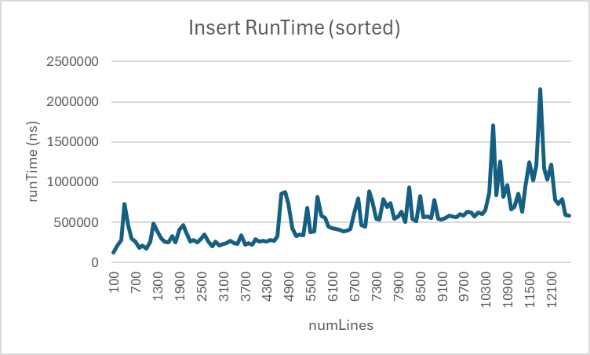
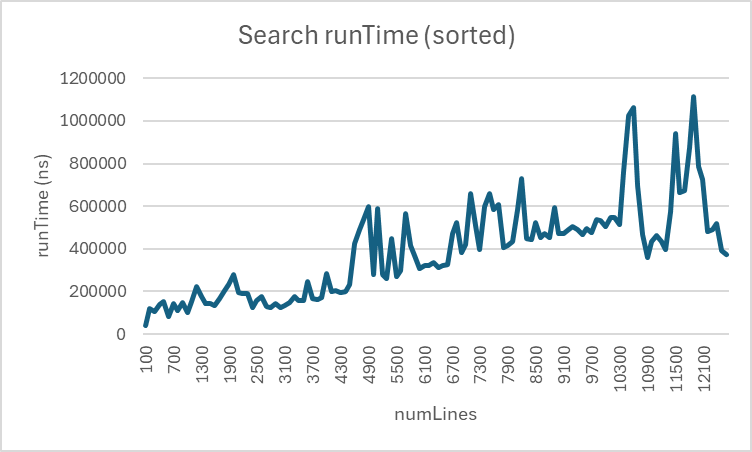
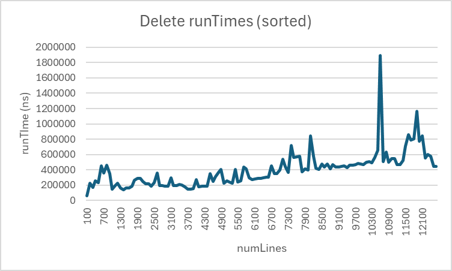
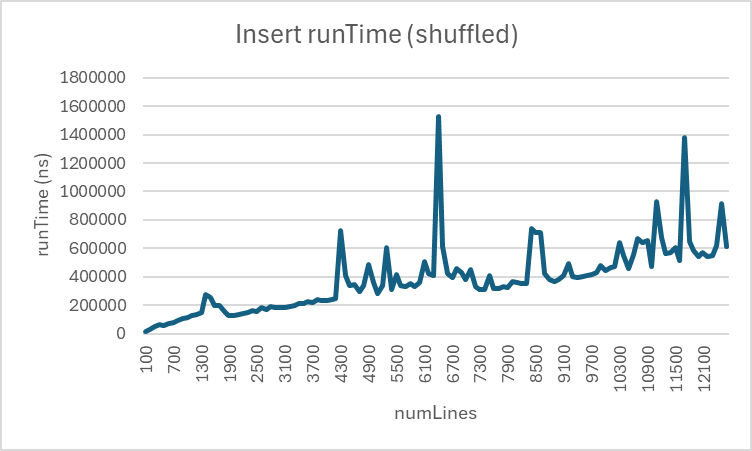
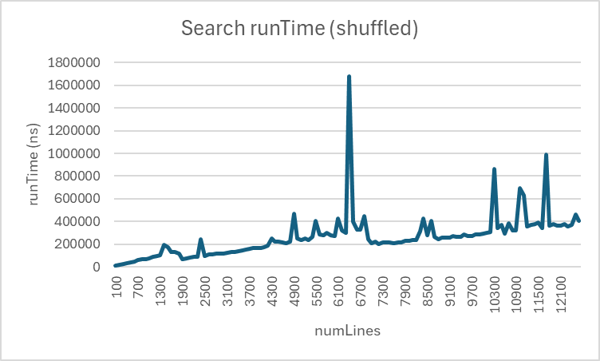
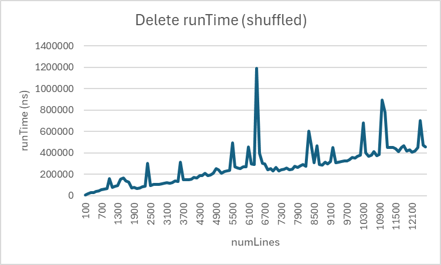
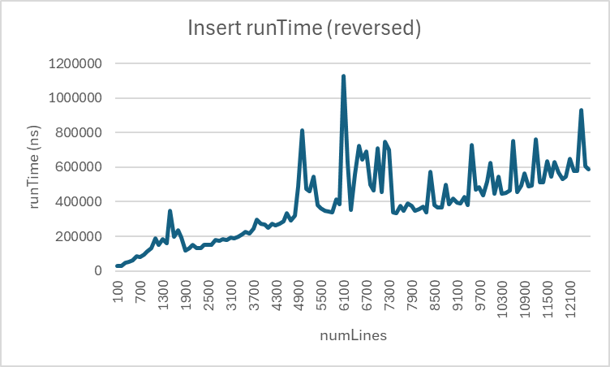
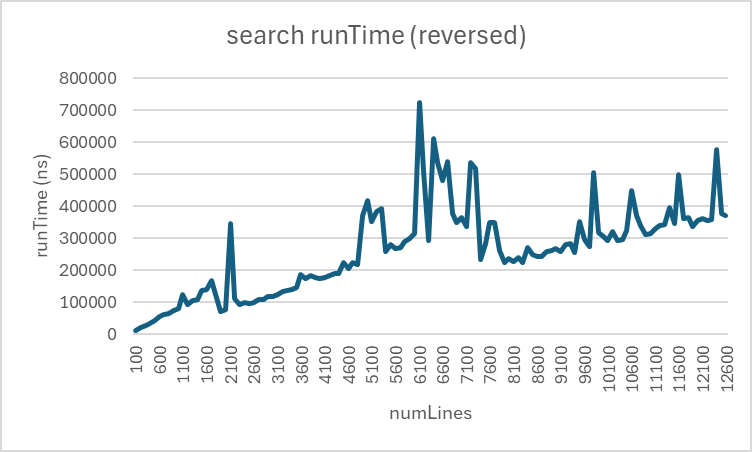

# Project 4 @ CSC 201 Fall 2025: Hash Tables

## Pledged Work Policy

This is a ___Pledged Work___ assignment.  This means that the work you submit for grading ___must___ be your work product.  
You may not submit the work of others outside of your team, or the modification of work of others outside of your team.
You are encouraged to talk with each other about general problems.  For example, you may talk to someone about "What does
it mean when the compiler says there is a semicolon missing on line 20", or "I can not get my assignment template to
download from GitHub, what did you do?".  However, you may not engage in "Could you send me a copy of your work so I can
see how to get started?".  You may get full and detailed assistance from me, the Teaching Assistant (TA), and the TAs in
the Computer Science Center.  If you have any question about the appropriateness of assistance, do not hesitate to
consult with me.

If I believe you have violated our ___Pledge Work___ agreement, I will pursue this matter through the college Honor Council.

## Overview

A hash table is a fundamental data structure that stores key-value pairs. It uses a hash function to compute an index
(hash) into an array of buckets or slots, from which the desired value can be found. The hash function is used to 
transform the key into the index of the array that will be used to store the value. Hash tables offer average case 
O(1) time complexity for lookups, insertions, and deletions, assuming that the hash function is well-designed and the
load factor is kept low.

In this project, you will 

1. Implement a hash table that uses separate chaining to handle collisions.
2. Perform the hash table insert, search, and delete operations using already-sorted, shuffled, and reversed datasets 
lists as input.
3. Time the insert, search, and delete operation performances for the different number of inputs.
4. Graph and analyze the performance of the hash table operations.
5. Document your dataset and results in a `README.md` file.

## Invocation and I/O Files:

The name of the program is `Proj4` ( provided with a `main` method in`Proj4.java` ).

You are encouraged to run and debug code in __IntelliJ IDEA__. Also, the program can be invoked from the command-line as:

```shell
java Proj4 {dataset-file} {number-of-lines}
```
## 1. **Implement Separate Chaining Hash Table**

I have enclosed one starter code:
1. `SeparateChainingHashTable.java`
2. `TestSeparateChainingHashTable.java`
3. `Proj4.java`

The `SeparateChainingHashTable.java` file contains an overall structure of that Separate Chaining Hash Table class, and 
you are expected to complete the code where it is indicated (Search for // FINISH ME). The 
`TestSeparateChainingHashTable.java` file must not be modified, and it will be used for testing your Separate Chaining 
Hash Table class. It does not check for every error, but I hope that it will be helpful for you. The Proj4.java file 
contains a starter code for you to implement the main driver of the program.

The program takes in two command line arguments: 1) the filename if your dataset and 2) the number of lines of your 
dataset to read.

## 2. **Perform Hash Table insert, search, and delete operations on Already-Sorted, Shuffled, and Reversed Lists**

You will read your dataset and store the data in an ArrayList. To sort and randomize your ArrayList, you will use the
`Collections.sort()`, `Collections.shuffle()`, and `Collections.sort(al, Collections.reverseOrder())` commands,
respectively.

## 3. **Time Sorting Algorithm Performance**

For the hash table insert, search, and delete operations, you will use `System.nanoTime()` to calculate
the time it takes to run them on already-sorted, shuffled, and reversed lists.

Your program will print out the number of lines evaluated and the times insert, search, and delete each of the dataset 
elements into the already-sorted, shuffled, and reversed lists to the screen in a human-readable format (i.e., nice to 
look at) and also separately to a file named `analysis.txt` in CSV format. Each time the program runs, it will append 
the timing results to `analysis.txt`. At the end of your run, your hash table should be completely empty.

## 4. **Graph and Analyze the Performance of the Sorting Algorithms**

Run your program several times for different number of lines of your dataset, N, by choosing different values of the
second command line argument. After several runs, your `analysis.txt` file will be filled with timing and comparison data.

Using your favorite graphing software (e.g., MS Excel or Google Sheets), plot the running time (in seconds) vs. N for 
each case. Take a screenshot of your graph and put them here by modifying this file, committing, and pushing
it to this repository.

Insertion, search, and deletion running time (already sorted):
 = insertion 
 = search
 = deletion


Insertion, search, and deletion running time (shuffled):
 = insertion
 = search
 = deletion

Insertion, search, and deletion running time (reversed):
 = insertion
 = search
 = deletion

## 5. **Document your Dataset and Results**
Document the source of your dataset and any modifications you made to it. Describe the results of your analysis and 
how it compares to the theoretical performance of the hash table operations.

Dataset Source: // nikhil1e9. “MyAnimeList Anime and Manga dataset.” Kaggle, 2023, https://www.kaggle.com/datasets/nikhil1e9/myanimelist-anime-and-manga. Accessed 3 Dec. 2025.
Dataset Modifications ("None" if unchanged): // NONE
Result Analysis: // First I will explain what should happen theoretically and then I will discuss my results. The average runTimes
    for hash table implementation of Insert, Remove, and Search should run at around O(1), so for N lines, performing insert remove and search 
    on each of the N elements, runtime should be at O(N). In the case, however, that rehashes are required, the worst case runtime will come to
    O(N) for each of these individual operations, leading to final runtimes of O(N^2) when performed on each element. Assuming only average runtimes,
    one would expect a graph of increasing elements to the runtime of insert, remove, and search operations to be linear and increasing at a rate  
    proportional to the number of lines. Deviations between the sorted, shuffled, and reversed list runtimes should only be due to differences in the 
    hash function and rehashing. 
        In my own results, I found average lines increase roughly linearly with the number of lines being read and analyzed. Additionally, there were
    many large peaks in each graph, which are likely due to rehashing giving worst-case runtime. Additionally, my set hashtable size was somewhat small, so
    more rehashes than necessary were often used, leading to many unnecessary peaks that could be fixed by changing the initial hash table size. 

## Submission:

Your project will be developed and graded via GitHub. Your final "push" is your final submission, and it must occur
before it is due. On Canvas, enter the url to your Github repository. Your project will not be graded without it.

## Recommendations:

I ___strongly suggest___ that you carefully think through your strategy before just jumping into the code.  Once that
is working, start adding in new features individually.  A good place to start is building your class.

*In order to get full points of Commenting and Code Style, you need to add comments to every method and head comments
for each file (providing file description, author, date, and acknowledgement).

```
/∗∗∗∗∗∗∗∗∗∗∗∗∗∗∗∗∗∗∗∗∗∗∗∗∗∗∗∗∗∗∗∗∗∗∗∗∗∗∗∗∗∗∗∗∗∗∗∗∗∗∗∗∗∗∗∗∗∗∗∗∗∗∗∗∗∗∗∗∗∗*
∗ @file: filename.java
∗ @description: This program implements . . .
∗ @author: Your Name
∗ @date: December 4, 2025
∗∗∗∗∗∗∗∗∗∗∗∗∗∗∗∗∗∗∗∗∗∗∗∗∗∗∗∗∗∗∗∗∗∗∗∗∗∗∗∗∗∗∗∗∗∗∗∗∗∗∗∗∗∗∗∗∗∗∗∗∗∗∗∗∗∗∗∗∗∗∗/
```
